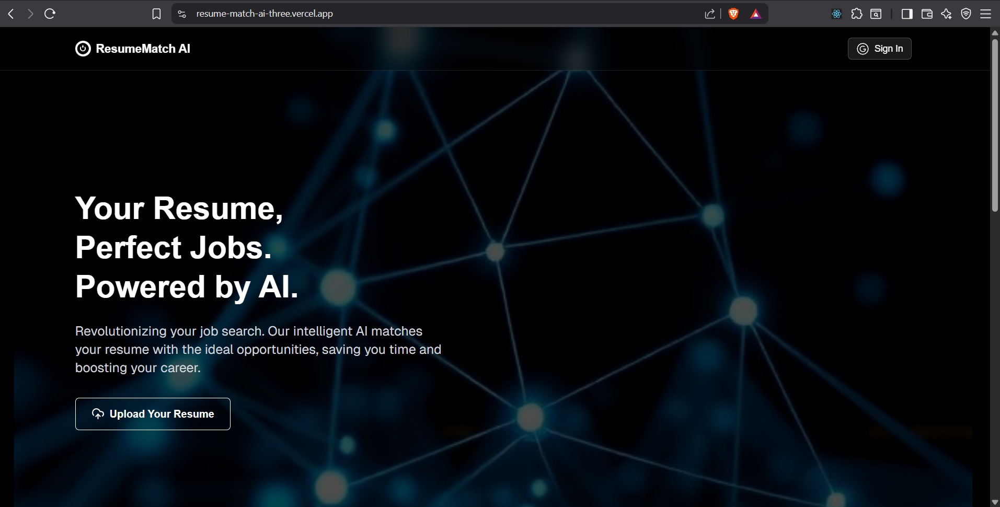

ResumeMatch AI

AI-powered resume analyzer that intelligently matches your resume with the most relevant and up-to-date job postings based on your skills and experience.

   

More info at: https://resume-match-ai-three.vercel.app

✨ Features

- 🧠 Smart resume analysis using AI (Groq API)
- 🔍 Personalized job matching based on your skills
- 📄 Upload and parse resumes in PDF format
- 💡 AI generated actionable suggestions to improve your resume
- 🔐 Secure authentication with Google (via NextAuth)
- 💾 Lightning-fast job caching with Upstash Redis
- ⚡ Lightweight and global state management using Zustand
- 🌐 Fully responsive and modern UI with Tailwind CSS

🛠 Tech Stack

Frontend

- Next.js
- React
- TailwindCSS
- Zustand

Backend

- Node.js
- MongoDB
- NextAuth
- Groq API

Others

- Upstash Redis (caching)
- pdf2json (PDF parsing)
- Reactbits library (animations)

📬 Contact

👨‍💻 Daman

Portfolio: https://daman-portfolio-teal.vercel.app
GitHub: https://github.com/daman599
Twitter: https://x.com/daman76752
